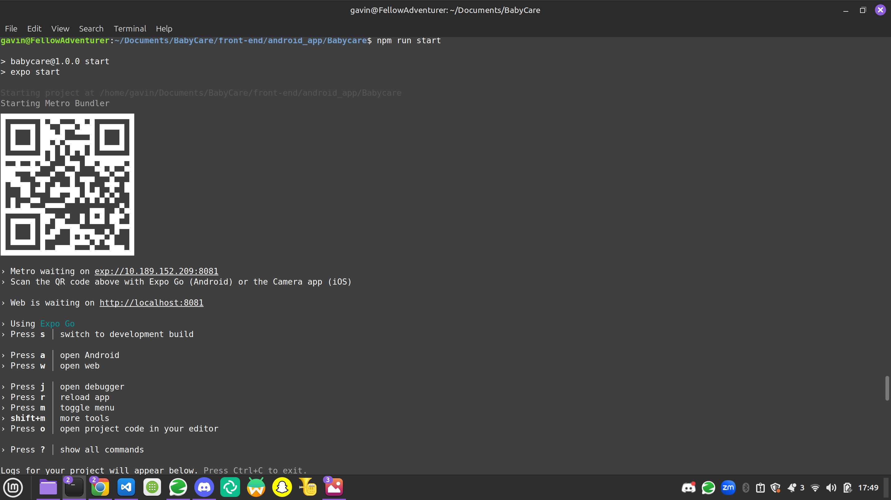
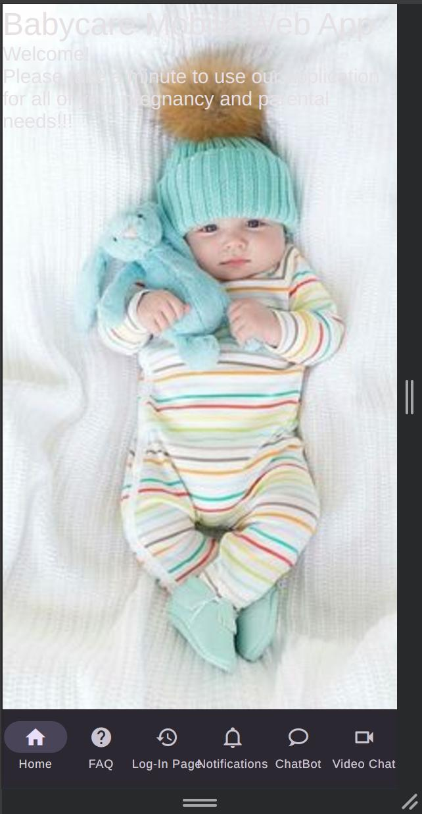
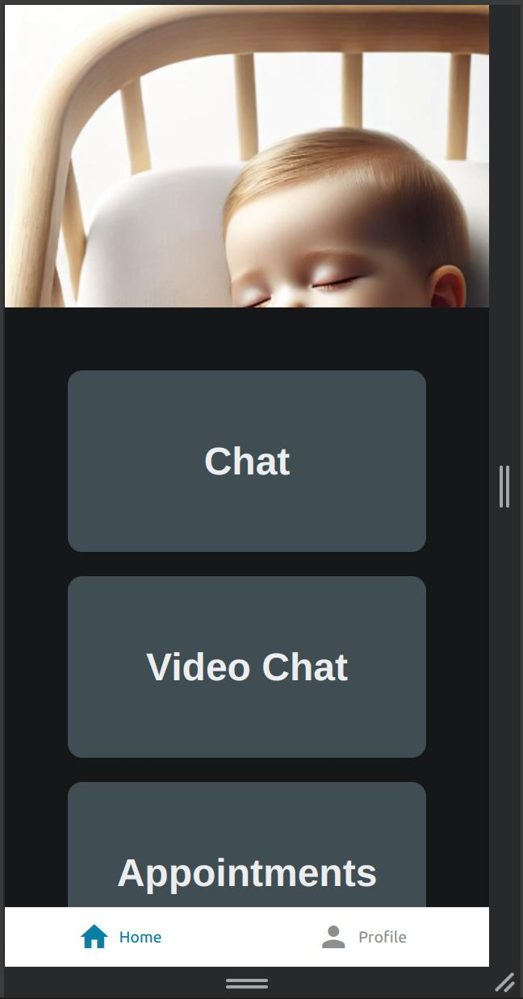

# BabyCare

## Team Members

The team members of our team are as follows:

* Mohamed Azam
* Gavin Johnson
* Qingyang Li
* Jhoseline Abavca
* Antarip Saha

## Team Number

Our team number listed under the section of this class is Group 2.

## Section

The section number of this group project is section# 550-75_76-4248.

## Brief Description

The project our team has chosen to complete for this course
 is a Baby Care mobile application.

This mobile application is to be used by pregnant women and new
mothers who may need guidance in either managing their pregnancy
or balancing the responsibilities and stress of being a new mother.

Our application is to act in assisting in the communication between
mothers/pregnant women and doctors throughout the guidance process.
Additionally, our mobile application may be used, not only to select
from one of applicable doctors for quality care from the mother's
client-side, but also may be used for mothers to select from one
of many quality babysitters as well. We will also include an AI
chatbot for patient use in our project.

## Instructions for Mobile Application Execution

To run our mobile application, download it to whichever directory
exists on your local machine you choose via the following command:

<code>git clone https://github.com/TheProgramMaster/BabyCare.git</code>

This should download the directory containing all code in this
repository to a folder named 'BabyCare'. Navigate into this
file through the command:

<code>cd BabyCare</code>

From here, change dorectories into the front-end of the code
through the command:

<code>cd front-end</code>

Then navigate into the option labeled 'new-ui through
the following command:

<code>cd new-ui</code>

Then navigate into the directory intended for builds of
android mobile devices via the command:

<code>cd android</code>

To execute the front-end portion for the AI chatbot, you will
need to open a second terminal, as a node.js file name server.js
exists to run the back-end of the token generation for this feature.

Open a second terminal, and navigate as previously instructed until
you get to ~/BabyCare/front-end/new-ui/android.
From here, run the command:

<code>node server.js</code>

This will create a message in your terminal stating:

Server running on port 3001

This means the back-end portion of the code running in Node.js for
the AI ChatBot will be operating through port 3001 of your local
machine's browser. Go back to the first terminal instructed.

First make sure to download and install all relevant packages for
this project package via the node package manager through the
following command:

<code>npm install</code>

This will install all of the packages necessary to run and execute
this part of the project's software source code.
Run the following command to host the front-end portion of code
for the AI ChatBot and Video Call/Chat feature:

<code>npm run start</code>

You should see a message in your terminal similar to the following:

This means your project built and executed as intended!
Now, open a tab in your browser, and navigate to:

localhost:8081

As the front-end of our mobile application operates on port 8081 of our
local machine, if the code builds as intended, you should see the mobile
application run, and find the following image on your desktop or mobile
application:

Congratulations! You've have a running instance of the AI ChatBot and
Video call/chat feature!

You can use the AI ChatBot whenever and however you wish. However, when
entering a call in the Video Call/Chat feature, you may enter yourself
as any name you wish, how, for the Room ID, you must enter the following
value as your room ID token:

6721d66d849b17dcfc918c90

Enter a name, hit join button to join, and you should see yourself
depicted through your computer's or mobile device's web camera.
Additionally, you should see a chat feature, as given, complete
with video hide and mute/unmute buttons at the bottom of the screen.

##Instructions for executing Notification/Appointment Features

To run this part of our project, port 8081 of your local machine's browser
must be free. Therefore, you will need to either terminate the terminal
from the previous portion of these instructions, or close said terminal
entirely and open a new terminal window, then navigate into the 
directory in which this project's source code is saved and stored.
To run the portion of our project to depict the notification and
appointment features, navigate into:

<code>~/BabyCare/front-end/android_app/Babycare</code>

Then, from here, all you have to do is execute the command:

<code>npm install</code>

To download and install any and all relevant packages in Node.js
via the node package manager, and then run the command:

<code>npm run start</code>

To run the front-end portion of our code. Then, just as before,
open another tab on the browser of your local machine, and navigate to 

localhost:8081

The page should be depicted similarly as follows:

Congratulations! This means you have a working instance of our notification
and appointments features in your local machine operating on port 8081!